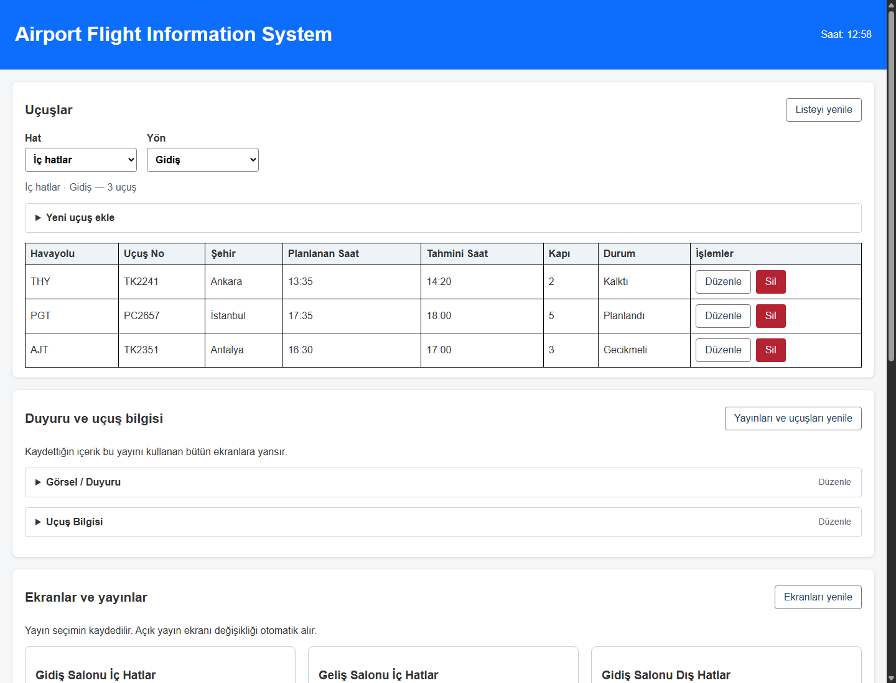
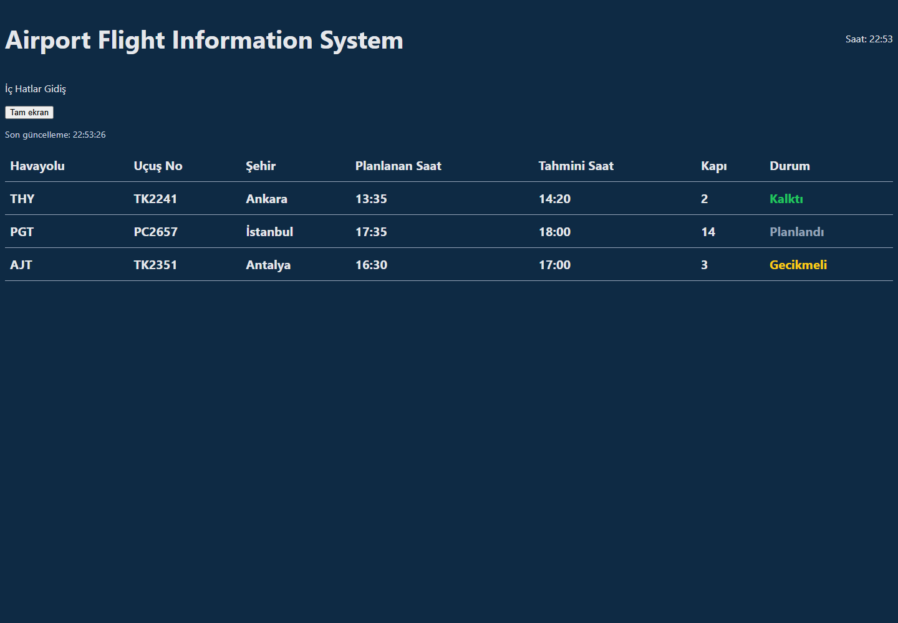
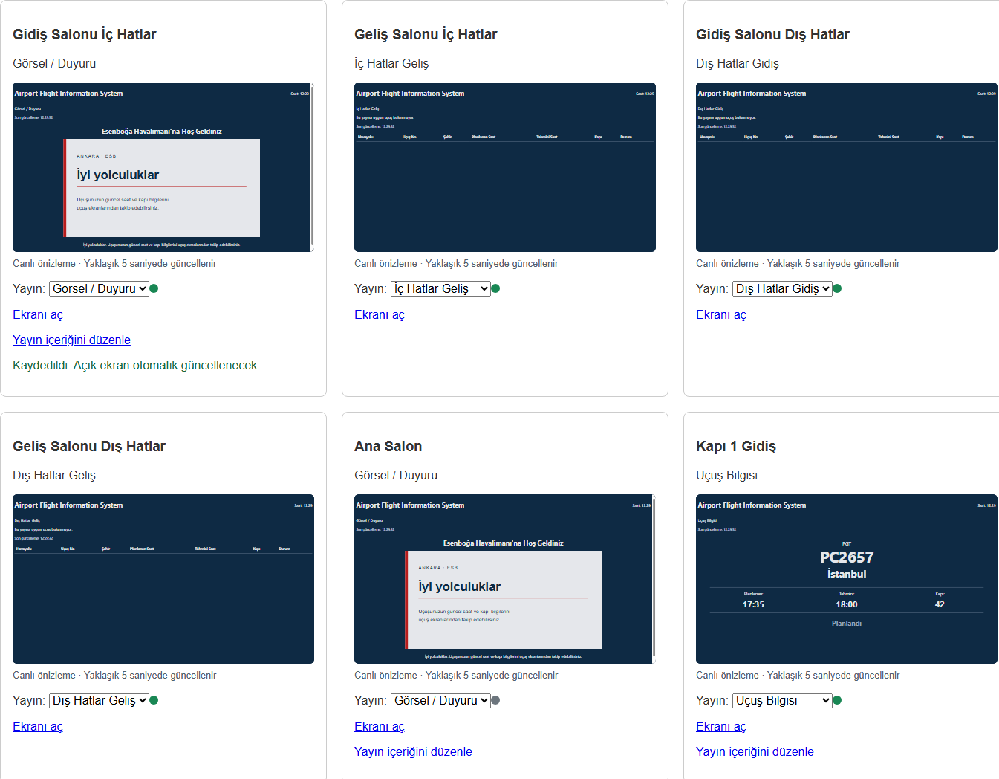

# Havalimanı Uçuş Bilgi Ekranı Yönetim Sistemi

Ankara Esenboğa Havalimanı (ESB) için uçuş bilgi ekranlarını yöneten web tabanlı bir sistem. Terminaldeki monitörlerde hangi içeriğin görüneceği tek bir panelden belirlenir.

14 günlük geliştirme planı tamamlandı. Uçuş yönetimi ve kalıcı yayın atama mevcut
`index.html` ana sayfasındadır. `ekran.html?id=1` gibi adresler monitörün yayın görünümüdür.

---

## Projenin amacı

Bu projenin öncelikli amacı hızlıca çalışan bir ürün ortaya çıkarmak değil, **web geliştirmenin temel mantığını uçtan uca öğrenmektir.**

Bu nedenle proje bilinçli olarak:

- Framework kullanmadan (React, Vue vb. olmadan) saf HTML/CSS/JavaScript ile geliştirilmektedir
- Katman katman ilerlemektedir (statik arayüz → dinamik veri → API → veritabanı)
- Gereksiz teknoloji ve karmaşık mimariden kaçınmaktadır

Öğrenilmesi hedeflenen konular:

**Frontend:** DOM, event, array metotları (`filter`, `map`, `forEach`), uygulama durumu (state) yönetimi, `fetch()`, `async`/`await`, HTTP istek mantığı

**Backend:** HTTP, REST API, endpoint, request/response, JSON, HTTP status kodları, path parametreleri

**Veritabanı:** Temel SQL (`CREATE TABLE`, `SELECT`, `INSERT`, `UPDATE`, `DELETE`), foreign key, SQLAlchemy ile ORM mantığı

---

## Sistem nasıl çalışıyor

Sistem iki ayrı arayüzden oluşur:

**Yayın ekranı** — Monitörde görünen sayfa. Koyu zemin ve büyük yazılarla uçuş bilgilerini gösterir; düğmeyle tam ekran açılabilir. Her monitör kendi adresini açar (`ekran.html?id=3` gibi).

**Ana sayfa (`index.html`)** — Uçuş ekleme, düzenleme, silme ve ekranlara yayın atama burada yapılır. Ayrı bir admin sayfası veya giriş ekranı bulunmaz.

### Çekirdek kavramlar

Sistemin tamamı bu üç kavramın birbirinden ayrı tutulmasına dayanır.

| Kavram | Nedir | Örnek |
|--------|-------|-------|
| **Uçuş** | Ham veri | VF4304, Van, 14:25, Kapı Kapandı |
| **Yayın** | İçerik tanımı (tip + filtre) | "İç Hatlar Gidiş" = liste + giden + iç hat |
| **Ekran** | Fiziksel monitör + o an gösterdiği yayın | "Gidiş Salonu Sol" → İç Hatlar Gidiş |

Bir yayın birden fazla ekranda gösterilebilir. Bir ekranın yayınını değiştirmek, tek bir alanı güncellemektir.

### Ekran tipleri

| Tip | Ne gösterir |
|-----|-------------|
| Liste | Çok satırlı uçuş tabelası (gelen/giden, iç hat/dış hat filtreli) |
| Tek uçuş | Kapı veya kontuar ekranı — tek uçuşun büyük gösterimi |
| Görsel | Başlık ve duyuru görseli |

---

## Teknolojiler

| Katman | Teknoloji |
|--------|-----------|
| Frontend | HTML, CSS, JavaScript |
| Backend | Python, FastAPI |
| Veritabanı | SQLite, SQLAlchemy |

---

## Özellikler

Tamamlanan özellikler:

**Yayın ekranı**

- [x] Uçuş listesi ekranı (gelen / giden)
- [x] İç hat / dış hat ayrımı
- [x] Tek uçuş ekranı (kapı / kontuar)
- [x] Görsel ve duyuru ekranı
- [x] Tam ekran görünüm
- [x] Otomatik yenileme

**Ana sayfa**

- [x] Ekran listesi ve kayıtlı durum göstergesi
- [x] Ekran kartlarında canlı yayın önizlemesi
- [x] Ekrana kalıcı yayın atama
- [x] Uçuş listesi görüntüleme
- [x] İç/dış hat ve gidiş/geliş seçimine göre uçuş filtreleme
- [x] Uçuş ekleme
- [x] Uçuş düzenleme
- [x] Uçuş silme
- [x] Açılır kapanır uçuş ve yayın düzenleme formları
- [x] Duyuru düzenleme, görsel yükleme ve tek uçuş seçimi

**Altyapı**

- [x] REST API ile veri sunumu
- [x] Veritabanı entegrasyonu
- [x] Uçuşlar için tam CRUD işlemleri

### Uçuş durumları

Planlandı · Kontuar Açık · Kapı Kapandı · Gecikmeli · İndi · Kalktı · İptal Edildi


---

## Veri stratejisi

Proje gerçek kurum verisine bağımlı değildir. Geliştirme ve testler **örnek uçuş verileri** ile yapılır. Bu kayıtlar gerçek veya güncel ESB uçuş trafiğini temsil etmez.

---

## Klasör yapısı

```text
flight-info-system/
├── backend/
│   ├── main.py
│   ├── database.py
│   ├── models.py
│   ├── schemas.py
│   ├── images.py
│   ├── requirements.txt
│   ├── schema.sql
│   ├── seed.sql
│   ├── exercises.sql
│   └── init_db.py
├── frontend/
│   ├── index.html
│   ├── ekran.html
│   ├── api.js
│   ├── app.js
│   ├── flights.js
│   ├── yayinlar.js
│   ├── saat.js
│   ├── script.js
│   ├── css/
│   │   ├── panel.css
│   │   └── ekran.css
│   └── images/
│       └── hos-geldiniz.svg
├── tests/
│   └── test_flights_api.py
├── baslat.bat
├── frontend-baslat.bat
└── README.md
```

---

## Kurulum

### Frontend

Önce aşağıdaki Backend bölümündeki kurulumu tamamla ve `baslat.bat` ile API'yi çalıştır.
Frontend için `frontend-baslat.bat` dosyasına çift tıklayabilirsin. Terminalden başlatmak
istersen projenin ana klasöründe ikinci bir terminal aç ve çalıştır:

```powershell
.\.venv\Scripts\python.exe -m http.server 5500 --bind 127.0.0.1 --directory frontend
```

- Panel: http://127.0.0.1:5500/index.html
- Liste yayını: http://127.0.0.1:5500/ekran.html?id=1
- Tek uçuş yayını: http://127.0.0.1:5500/ekran.html?id=6
- Görsel yayını: http://127.0.0.1:5500/ekran.html?id=5

Bu yayın türleri ilk kurulumdaki atamalardır; panelden yayın değiştirildiğinde aynı adres yeni atanan içeriği gösterir.

İki sunucu da açık kalmalı. HTML dosyalarını HTTP adreslerinden aç.
`5500` portu sayfaları, `8000` portu API verilerini sunar; backend'de `/index.html` adresi yoktur.
CORS ayarı `http://127.0.0.1:5500` kaynağına izin verdiği için bu adresi kullan.

Panelin kartları ve yayın ekranı verileri API'den alınır. Backend'e ulaşılamazsa açıklayıcı
bir hata mesajı gösterilir; backend'i yeniden başlatıp sayfayı yenileyerek tekrar deneyebilirsin.
Ana sayfadaki yayın seçimi backend'e kaydedilir; sayfa yenilense de korunur.
Açık yayın ekranı uçuşları ve yayın atamasını otomatik alır.

### Backend

Python 3.13.5 ile geliştirildi.

Projenin ana klasöründe sanal ortamı oluştur ve paketleri kur:

```powershell
python -m venv .venv
.\.venv\Scripts\python.exe -m pip install -r backend/requirements.txt
.\.venv\Scripts\python.exe backend/init_db.py
```

Sunucuyu başlatmak için `baslat.bat` dosyasını çalıştır.

- API: http://127.0.0.1:8000/
- Swagger: http://127.0.0.1:8000/docs

Sunucuyu durdurmak için terminalde Ctrl+C kullan.

### SQLite veritabanı (Gün 11)

Projenin ana klasöründe çalıştır:

```powershell
.\.venv\Scripts\python.exe backend/init_db.py
```

Komut `backend/flight_info.db` dosyasında tabloları oluşturur ve eksik örnek kayıtları ekler.
Temiz kurulumda 3 uçuş, 6 yayın ve 6 ekran bulunur. Tekrar çalıştırmak mevcut kayıtları
değiştirmez veya çoğaltmaz. Yol script'in konumundan belirlendiği için veritabanı hep
`backend` klasöründe oluşturulur. DB Browser'da bekleyen yazma işlemi varsa önce onu
kaydet veya geri al; açık bir yazma işlemi kurulum sırasında kilit hatasına neden olabilir.

| Dosya | Görevi |
|-------|--------|
| `schema.sql` | Tablolar, primary key, unique ve foreign key tanımları |
| `seed.sql` | Örnek uçuş, yayın ve ekran kayıtları |
| `init_db.py` | İki SQL dosyasını tek transaction içinde uygulayan kurulum komutu |
| `exercises.sql` | SELECT, WHERE, JOIN, UPDATE, DELETE ve geri alma alıştırmaları |

SQLite dosyası ve günlük dosyaları Git'e eklenmez; kurulum SQL dosyalarından tekrarlanabilir.
Tablo sırası `flights`, `pages`, `screens` şeklindedir. `screens.yayinId`, `pages.id` alanına;
`pages.ucusNo`, `flights.ucusNo` alanına bağlıdır. Ekrana atanmış yayın silinemez.
Bir uçuş silinirse ona bağlı yayının `ucusNo` alanı NULL olur; uçuş numarası değişirse
yayındaki bağlantı da güncellenir. Bu örnek model uçuş numarasını benzersiz kabul eder.

DB Browser for SQLite ile `backend/flight_info.db` dosyasını açıp Execute SQL sekmesinde
`exercises.sql` içindeki blokları sırayla çalıştırabilirsin. Her yeni bağlantıda, transaction
başlatmadan önce `PRAGMA foreign_keys = ON;` çalıştırılmalıdır.
`SAVEPOINT` geri dönülebilecek bir nokta belirler; `ROLLBACK TO` değişiklikleri geri alır,
`RELEASE` bu noktayı kaldırır. Alıştırmaları sonuna kadar çalıştırınca mevcut veriler korunur.
Kalıcı yazma işlemlerinde transaction `COMMIT` ile tamamlanır; kurulum komutu bunu kendisi yapar.

### SQLAlchemy bağlantısı (Gün 12)

API artık Python listeleri yerine `backend/flight_info.db` dosyasını okur.
`GET /flights`, `/pages` ve `/screens` her istekte veritabanını sorgular;
yanıtların alan adları ve yayınlardaki boş alanları gizleme davranışı korunur.

| Dosya | Görevi |
|-------|--------|
| `database.py` | Engine, her bağlantıda foreign key kontrolü ve istek başına Session |
| `models.py` | Tabloları Python sınıflarına eşleyen ORM modelleri ve ilişkiler |
| `schemas.py` | API yanıt alanlarını belirleyen Pydantic modelleri |
| `main.py` | Session üzerinden okuma ve yazma işlemlerini çalıştıran endpointler |

Engine veritabanına bağlanmayı sağlar. Session bir isteğin veritabanı işlemlerini
yürütür; `get_db` içindeki `yield` ile endpointe verilir ve istek bitince kapatılır.
ORM modeli tabloyu temsil eder; Pydantic modeli dışarıya dönen JSON'u tanımlar.
`from_attributes=True`, Pydantic'in ORM nesnesindeki alanları okuyabilmesini sağlar.

DB Browser'da bir uçuşun kapısını veya durumunu düzenleyip **Değişiklikleri Kaydet**
düğmesine bastıktan sonra `/flights` adresini ve yayın ekranını yenileyerek sonucu
görebilirsin. API'yi yeniden başlatmak gerekmez. Kaydedilmemiş değişiklikler ayrı
bağlantı kullanan API'ye yansımaz. Gün 14 itibarıyla açık yayın ekranları otomatik yenilenir.

Veritabanı kurulmamışsa veya okunamıyorsa veri endpointleri `503` döndürür ve
sunucu terminaline hata ayrıntısı yazılır. İlk kurulumda `init_db.py` çalıştırılmalıdır;
API başlarken otomatik örnek kayıt eklemez. `/` yalnızca sunucu mesajıdır,
veritabanı bağlantısını kontrol etmek için `/flights` adresini kullan.

### Panelden uçuş yönetimi (Gün 13)

`index.html` sayfasında hat/yön seçimi, açılır uçuş formu ve veritabanından yüklenen uçuş tablosu bulunur.
`flights.js` bu formu ve tabloyu yönetir; `app.js` ekran kartlarını yönetmeye devam eder.

- **Hat ve yön:** İç/dış hat ile gidiş/geliş seç; tabloda yalnızca o grubun uçuşları görünür.
  Başlangıçta iç hatlar gidiş gösterilir. Seçilen grubun uçuş sayısı ve boş grup mesajı görünür.
- **Yeni uçuş ekle:** Kapalı formu başlığına tıklayarak aç. Hat/yön seçimi forma hazır gelir.
  Uçuş numarası büyük harfe çevrilir ve benzersiz olmalıdır.
- **Düzenle:** Satırdaki düğme, ilgili uçuşun formunu açar. Kaydet veya **Vazgeç** ile kapat.
  Kayıt başka gruba taşınırsa tablo yeni grubuna geçer. Hata durumunda form açık ve dolu kalır.
- **Sil:** Onaydan sonra kayıt silinir. Bağlı tek uçuş yayını silinmez; yenilendiğinde uçuş bulunamadı mesajı gösterir.
- **Listeyi yenile:** Ana sayfada başka bir yerde kaydedilen uçuş değişikliklerini alır. Yayın ekranları otomatik yenilenir.

### Duyuru ve uçuş bilgisi düzenleme

Ana sayfadaki **Duyuru ve uçuş bilgisi** bölümünde yayın içerikleri düzenlenir.
Alanlar başlangıçta kapalıdır; yayın başlığına tıklayınca düzenleme formu açılır.
Ekran kartındaki **Yayın içeriğini düzenle** bağlantısı da ilgili kapalı alanı açar.

- **Görsel / Duyuru:** Yayın adı, başlık, görsel ve açıklama değiştirilebilir. Bilgisayardan
  PNG/JPEG/GIF/WebP seçilebilir (en fazla 2 MB); mevcut bir `images/...` yolu veya HTTP(S)
  görsel adresi de kullanılabilir. Önizleme görüntülenir; **Yayını kaydet** ile kalıcı kaydedilir.
- **Uçuş Bilgisi:** Gösterilecek uçuş listeden seçilir. Uçuş silinmişse başka bir uçuş
  seçilerek yayın yeniden kullanılabilir. Uçuş ekleme/silme sonrası seçenekler güncellenir.
- **Vazgeç:** Formu son kaydedilen değerlere döndürür ve kapatır. **Yayınları ve uçuşları yenile**
  sunucudaki güncel kayıtları yeniden getirir; kaydedilmemiş form değişikliklerini sıfırlar.

Değişiklikler aynı yayını kullanan bütün ekranlara otomatik yansır. Açıklama görselin
altında gösterilir. Liste yayınlarının filtreleri bu formlardan değiştirilmez.
Yüklenen görseller `frontend/images/uploads/` altında saklanır ve Git'e eklenmez.
Verilerini yedeklerken bu klasörü de SQLite dosyasıyla birlikte kopyala. Eski görseller
başka yayınlarda kullanılabileceği için otomatik silinmez.

API yanıtlarına sabit kayıt kimliği olan `id` eklendi. Düzenleme ve silme bu kimlikle yapılır;
uçuş numarası değişirse bağlı yayındaki numara da foreign key kuralıyla güncellenir.
`POST` yeni kayıt ekler, `PUT` uçuşun dokuz alanının tamamını günceller, `DELETE` kaydı siler.
Başarılı yazma işlemleri `commit()` ile kalıcı kaydedilir; hata durumunda oturum geri alınır.

Saatler `HH:MM` biçiminde olmalıdır. Boş alanlar, geçersiz yön/hat/durum ve uzunluk sınırını
aşan metinler reddedilir. Aynı numara için `409`, bulunamayan kayıt için `404`, geçersiz
girdi için `422` döner. Veritabanı kilidinde `503` ile DB Browser/SQLite bağlantılarını
kapatmayı anlatan mesaj gösterilir. Kaydetme hatasında formdaki bilgiler korunur.

Panelden yazmak için DB Browser açmak gerekmez. SQLite terminali veya DB Browser'da
bekleyen işlem bırakma; kaydetme başarılı olduktan sonra bağlantıyı kapat.
### Kalıcı yayın atama ve otomatik güncelleme (Gün 14)

Ana sayfadaki **Ekranlar ve yayınlar** bölümünde bir yayın seçince `PATCH /screens/{ekran_id}`
ile yalnızca `yayinId` güncellenir. **Kaydedildi** mesajı işlem tamamlandığında görünür.
Hata durumunda seçim önceki değere döner; bağlantı sorunu varsa yeniden kaydetmeden önce
**Ekranları yenile** düğmesiyle sunucudaki son durumu kontrol et.

**Ekranı aç** bağlantısı yalnızca ekran kimliğini taşır (`ekran.html?id=1`).
Eski bağlantılardaki `yayinId` parametresi artık dikkate alınmaz; kayıtlı atama kullanılır.
Aktif yayın sayfası her tamamlanan sorgu turundan yaklaşık 5 saniye sonra yeniden sorgular.
Bir tur bitmeden yenisi başlamaz; istekler 10 saniyede zaman aşımına uğrar.
Tarayıcı arka plandaki sekmelerin zamanlayıcılarını yavaşlatabilir.

Bağlantı kesilirse son alınan içerik, güncel olmayabileceğini belirten uyarıyla gösterilir.
Hiç veri alınmamışsa bekleme mesajı görünür. Bağlantı gelince içerik otomatik toparlanır.
Veri değişmediyse DOM yeniden çizilmez; görsel her turda tekrar yüklenmez ve tam ekran korunur.
İki sayfanın saati Türkiye saat dilimine göre güncellenir.

Ekran kartlarındaki online/offline değerleri örnek veritabanı kayıtlarıdır;
gerçek cihaz bağlantısını ölçmez. Uçuşlar ve yayın tanımları da örnek verilerdir.

Ana sayfadaki kartlar, yayın sayfasını `iframe` içinde canlı olarak gösterir.
Önizlemeler 1280×720 yayın görünümünden kart genişliğine ölçeklenir ve yaklaşık
5 saniyede güncellenir. Önizlemeye tıklamak yayını ayrı sekmede açar.
Ekrana yaklaşıldığında yüklenen bu önizlemeler kendi API sorgularını yapar;
altı ekranlık örnek kurulum için uygundur. Bu, uygulamanın yayın görünümüdür;
fiziksel monitörden görüntü veya bağlantı durumu alınmaz.

### Otomatik testler ve son kontrol

Otomatik API testleri her test için ayrı geçici veritabanı oluşturur; kendi kayıtlarına dokunmaz:

```powershell
.\.venv\Scripts\python.exe -B -m unittest discover -s tests -v
```

Elle denemek için panelden benzersiz numaralı bir deneme uçuşu ekle; sayfayı yenileyip
kaydın kaldığını gör. Kapısını düzenle, yeniden yenile, ardından deneme uçuşunu sil.
Aynı numarayla ikinci uçuş eklemeyi ve düzenlerken **Vazgeç** düğmesini de dene.
Gidiş/iç hat seçtiysen liste yayınını (`ekran.html?id=1`) yenileyerek sonucu görebilirsin.

Son günün kontrolü:

1. `baslat.bat` ve `frontend-baslat.bat` dosyalarını çalıştır; ana sayfayı aç.
2. Bir kartın **Ekranı aç** bağlantısını ikinci sekmede aç.
3. Ana sayfada aynı kartın yayınını değiştir; **Kaydedildi** mesajını bekle.
4. Yayın sekmesine geç; yaklaşık 5 saniye içinde yeni içerik görünmeli.
5. Ana sayfayı yenile; seçilen yayın korunmalı. Bir uçuşun kapısını değiştirip açık yayında güncellendiğini gör.
6. Backend'i Ctrl+C ile durdur; yayında bağlantı uyarısı görünmeli. Yeniden başlatınca sayfayı yenilemeden düzelmeli.

`veriGonder is not defined` gibi eski dosya hatalarında ana sayfayı `Ctrl+F5` ile yenile.
JavaScript ve CSS adreslerinde sürüm parametresi bulunur; ilgili dosyalar değiştirildiğinde bu sürüm de artırılır.

---

## API Endpointleri

| Metot | Endpoint | Açıklama |
|-------|----------|----------|
| GET | / | Sunucu mesajını ve havalimanı kodunu döndürür |
| GET | /flights | Uçuş listesini döndürür |
| GET | /flights/{ucus_id} | Tek uçuşu kayıt kimliğiyle getirir |
| POST | /flights | Uçuş ekler; 201 döndürür |
| PUT | /flights/{ucus_id} | Uçuşun tüm alanlarını günceller |
| DELETE | /flights/{ucus_id} | Uçuşu siler; gövdesiz 204 döndürür |
| GET | /screens | Ekran listesini döndürür |
| PATCH | /screens/{ekran_id} | `{ "yayinId": 5 }` ile kayıtlı yayını değiştirir |
| GET | /pages | Yayın listesini döndürür |
| PUT | /pages/{yayin_id} | Görsel veya tek uçuş yayınının içeriğini günceller |
| POST | /images | Ham görsel dosyasını yükler ve `resimYolu` döndürür; 201 |

---

## Mimari

```text
Ana sayfa (index.html) ── GET / POST / PUT / DELETE / PATCH ──┐
                                                           ├─ FastAPI ─ SQLAlchemy ─ SQLite
Yayın (ekran.html?id=1) ── periyodik GET ─────────────────────┘
```

`api.js` HTTP isteklerini ve hata yanıtlarını yönetir. `app.js` ekran atamalarını,
`flights.js` uçuş formunu, `yayinlar.js` duyuru/tek uçuş içeriğini, `script.js` ise otomatik güncellenen yayını yönetir.
Backend'de Pydantic girişleri doğrular; SQLAlchemy kayıtları okur ve değişiklikleri
transaction içinde kalıcı kaydeder. SQLite foreign key kuralları ilişkileri korur.

---

## Ekran görüntüleri

Geçici test veritabanıyla alınmış örnek görünümler. Son başlık ve düğme düzenlemeleri nedeniyle küçük görsel farklılıklar olabilir:







---

## Kapsam dışı

Aşağıdaki konular bu projenin kapsamına **bilinçli olarak dahil edilmemiştir.** Amaç, sınırlı sürede temel konuları sağlam öğrenmektir.

Çoklu havalimanı desteği · serbest metinle uçuş arama · kullanıcı girişi (authentication) · gerçek monitör donanımı entegrasyonu · mobil öncelikli tasarım · makine öğrenmesi ve yapay zekâ özellikleri · uçuş gecikme tahmini · canlı uçak takibi · pist yönetimi · mikroservis mimarisi · Kubernetes ve karmaşık deployment yapıları

**Ayrıca bilinçli olarak sadeleştirilenler:**

- CSS'te animasyon ve geçiş efektleri kullanılmamaktadır

---

## Geliştirme günlüğü

Her gün sonunda 2-3 satır not.

**Yazarken şunlara cevap ver:** Ne yaptım? Yeni ne öğrendim? Nerede takıldım, nasıl çözdüm?

### Gün 1 
HTML iskeletini kurdum ve tablo yapısını yazdım. CSS ile tabloya basit stil verdim. sonrasında tabloya örnek uçuş verilerini ekledim.

### Gün 2 
CSS değişkenleriyle renk sistemi kurdum, header'ı Flexbox ile hizaladım, section'ları kart görünümüne getirdim ve durum renklerini ekledim.

### Gün 3 
Uçuş verisini array içine taşıdım, tabloyu artık forEach ile diziden üretiyorum. Template literal (backtick) ile HTML satırı oluşturmayı öğrendim, durum bilgisine göre CSS class döndüren durumSinifi() fonksiyonunu yazdım.

### Gün 4 
ekran.html ve css/ekran.css dosyalarını ayırarak yayın ekranını panelden bağımsız hale getirdim, arama/istatistik bölümlerini çıkardım. Koyu tema için ayrı bir renk paleti kurdum, vh biriminin ekrana göre orantılı büyüdüğünü öğrendim ve kullandım.

### Gün 5 
Panelde ekran kartı listesini kurdum. screens dizisini oluşturdum, CSS Grid ile 3 sütunlu kart düzeni yaptım, aspect-ratio ile kart oranlarını sabitledim. Durum göstergesi (online/offline) için statusClass() fonksiyonu yazdım, noktanın rengini kart durumuna göre değiştirdim.

### Gün 6
Yayınları pages dizisinde tanımladım ve ekranlarla yayinId üzerinden ilişkilendirdim. Seçim değişince kartları yeniden çizdirdim; URL parametreleri ve filter ile yayın ekranında uygun uçuşları gösterdim. Fullscreen API ile düğmeden tam ekran açmayı ekledim.

### Gün 7
Tek uçuş yayınına ucusNo ekledim; find ile bulunan uçuşu büyük yazılarla gösterdim.
Görsel yayınına başlık, resim yolu ve alternatif metin ekledim; yerel bir SVG duyuru görseli hazırladım.
Yayın tipine göre ilgili alanı açıp diğerlerini gizledim; bulunamayan uçuş ve yüklenemeyen görsel için hata mesajı ekledim.

### Gün 8
Python sanal ortamını hazırladım, FastAPI ve Uvicorn kurdum.
İlk GET endpointini yazdım; sunucu mesajını ve havalimanı bilgisini JSON olarak döndürdüm.
Paket sürümlerini requirements.txt dosyasına kaydettim ve baslat.bat ile başlatmayı kolaylaştırdım.

### Gün 9
Uçuş, ekran ve yayın verilerini Python listelerine taşıdım.
Pydantic modelleriyle yanıt alanlarını tanımladım; yayınlar için isteğe bağlı alanlar kullandım.
GET /flights, /screens ve /pages endpointlerini ekledim.

### Gün 10
Paneli ve yayın ekranını ortak api.js dosyasındaki fetch fonksiyonuyla backend'e bağladım.
async/await ile verilerin gelmesini bekledim; HTTP hatalarını kontrol edip try/catch ile hata mesajları gösterdim.
Frontend'deki sabit verileri kaldırdım, CORS ayarını ve iki sunucuyla çalıştırma adımlarını tamamladım.

### Gün 11
SQLite'ta flights, pages ve screens tablolarını oluşturdum; primary key ve foreign key ilişkileriyle örnek verileri ekledim.
SELECT, WHERE ve JOIN sorgularını; UPDATE ve DELETE işlemlerini SAVEPOINT ve ROLLBACK ile denedim.
Tekrarlanabilir veritabanı kurulum komutunu hazırladım; kayıtların korunmasını ve foreign key kurallarını kontrol ettim.

### Gün 12
SQLAlchemy engine ve istek başına Session ile API'yi mevcut SQLite veritabanına bağladım.
ORM tablo modellerini ve Pydantic yanıt şemalarını ayırdım; üç GET endpointindeki sabit listeleri SELECT sorgularıyla değiştirdim.
Yanıt uyumluluğunu, kayıt değişikliklerinin yeni isteklere yansımasını ve veritabanı hata durumunu kontrol ettim.

### Gün 13
Uçuş ekleme, düzenleme ve silme endpointlerini; panelde form, uçuş tablosu ve silme onayını ekledim.
Girdi doğrulamasını, benzersiz uçuş numarasını, hata mesajlarını ve commit/rollback ile kalıcı kayıt işlemlerini öğrendim.
Geçici veritabanında CRUD, bağlı yayınlar ve kilit hatasını test ettim; panelde girilen metinleri güvenli biçimde gösterdim.

### Gün 14
Ekrana yayın atamasını PATCH endpointiyle kalıcı kaydettim; açık yayınların uçuş ve atama değişikliklerini otomatik almasını sağladım.
Bağlantı hatasında eski veri uyarısı, otomatik toparlanma, istek zaman aşımı ve güncel saat gösterimi ekledim.
API ve iki sekmeli tarayıcı kontrollerini tamamladım; kurulum, mimari, kullanım ve ekran görüntülerini belgeledim.

Ana sayfaya duyuru içeriği, görsel yükleme/önizleme ve tek uçuş seçimi ekledim.
Yayın içeriklerinin kalıcı kaydını, hatalı girişleri ve açık ekranlara otomatik yansımasını test ettim.

---


## Lisans

Bu proje staj çalışması kapsamında eğitim amaçlı geliştirilmiştir.
